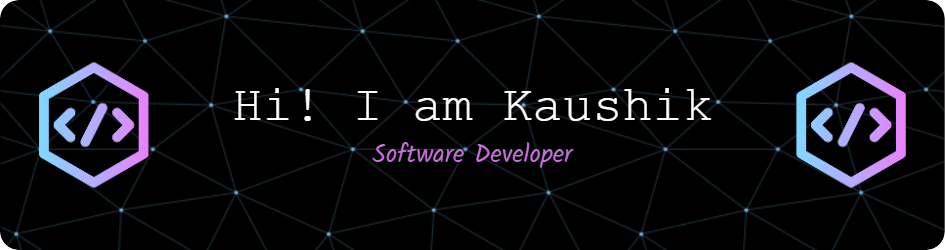

### Hi there👋, I am Kaushik 🧑🏽‍💻 

<!-- -->

I am a computer science graduate student with two years of prior software development experience. Actively seeking for a Summer-2024 internship that will help in implementing and refine my technical expertise, allowing me to contribute to real-world projects, learn from experienced professionals, and take an active role in advancing the field of computer science.

- 🎓 Masters in Computer Science / University of Omaha. 
- 🔭 I’m currently working on Reinforcement Learning and Deep learning.

